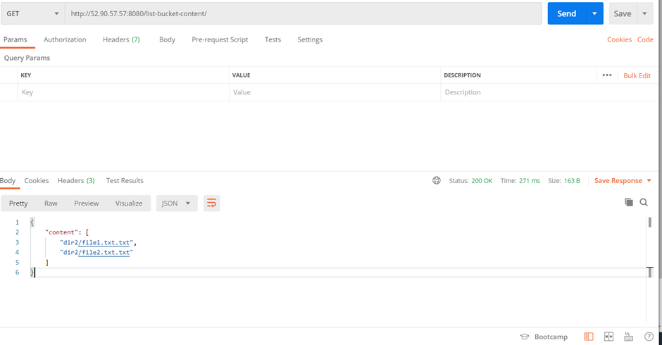

## AWS S3 Api

> `Description` -  This api exposes the endpoint to list the contents of `aws s3 bucket`.

### Prerequisites

- Go (version >= 1.19)
- AWS SDK for Go (`github.com/aws/aws-sdk-go`)
- We have used the aws iam role attached to ec2 instance to authenticate with s3 bucket.

### Directory Structure

```bash
.
├── cmd
│   └── main.go
├── go.mod
├── go.sum
├── modules
│   └── aws.go
└── server
    ├── handlers
    │   └── aws.go
    ├── routes.go
    └── server.go
```

### Configuration

- Update the AWS region in modules/aws.go (GetS3Content function) if necessary.
- Update the S3 bucket name in server/handlers/aws.go (HandleS3BucketContent function) if necessary.

### Usage

1. Build and run the application

```bash
cd cmd/
go build -o s3-api && ./s3-api
```
2. Access the endpoint to list S3 bucket content:
```bash
GET http://ip-host:<port-number>/list-bucket-content/<path>
```


### Screenshots





## Terraform Configuration

> `Description` : The infrastructed for running and deploying api is created on AWS using terraform.

## Prerequisites

- Terraform installed on your local machine
- AWS asssume_role configured with appropriate permissions (we have used assume role to authenticate with aws).
- AWS CLI installed (optional for managing AWS resources outside Terraform)


### Directory Structure

```bash
.
├── main.tf
├── modules
│   └── ec2_instance
│       ├── main.tf
│       ├── outputs.tf
│       └── variables.tf
├── output.tf
├── terraform.tfvars
├── userdata.sh
└── variables.tf
```


### main.tf
- Configures the AWS provider with the specified region and assumes a role if provided.
- Creates an S3 bucket with private ACL and disables versioning.
- Defines an IAM policy to grant EC2 instances full access to the S3 bucket.
- Creates an IAM role and attaches the IAM policy.
- Creates an IAM instance profile associated with the IAM role.

### modules/ec2_instance/main.tf
- Defines an AWS security group with ingress rules for SSH and the Go API port for my ip, and egress rule allowing all traffic.
- Creates an EC2 instance with specified configuration including AMI, instance type, subnet, security group, etc.
- Configures a provisioner to copy files to the EC2 instance.
- Uses userdata to install golang then build and run the application.


### Usage

1. Initialize Terraform:

```bash
    terraform init
```
2. Validate Terraform configuration:

```bash
    terraform validate
```

3. Review the Terraform plan: 

```bash
    terraform plan
```
3. Apply the Terraform changes:

```
    terraform apply
```

### Customization

- Update variables in `terraform.tfvars` to customize your infrastructure.
- Modify Terraform configuration files (main.tf, modules/ec2_instance/main.tf, etc.) as needed.


### Screenshots

1. Applying terraform config


2. S3 Bucket created by terraform

> Bucket is created my `terraform` but data has been added manually.


3. IAM Role and Policy created by terraform


4. EC2 instance created by terraform


